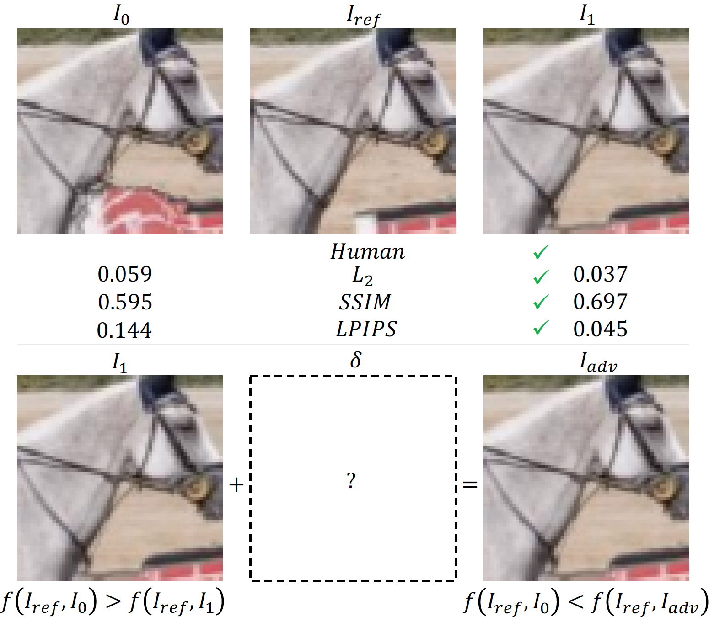

# Attacking Perceptual Similarity Metrics

[Abhijay Ghildyal](https://abhijay9.github.io/), [Feng Liu](http://web.cecs.pdx.edu/~fliu/). In TMLR, 2023. [(Featured Certification)](https://jmlr.org/tmlr/papers/#) 

[[OpenReview]](https://openreview.net/forum?id=r9vGSpbbRO) [[Arxiv]]()

In this study, we systematically examine the robustness of perceptual similarity metrics to imperceptible adversarial perturbations.



Figure (above): $I_1$ is more similar to $I_{ref}$ than $I_{0}$ according <br/> 
to all perceptual similarity metrics and humans. We attack <br/>
$I_1$ by adding imperceptible adversarial perturbations ($\delta$) <br/>
such that the metric ($f$) flips its earlier assigned rank, i.e., <br/>
in the above sample, $I_0$ becomes more similar to $I_{ref}$.

<br/>


Figure (above): An example of the PGD attack on LPIPS(Alex)


## Requirements

Requires Python 3+ and PyTorch 0.4+. For evaluation, please download the data from the links below. 

When starting this project, I used the `requirements.txt` [(link)](https://github.com/richzhang/PerceptualSimilarity/blob/master/requirements.txt) from the LPIPS repository [(link)](https://github.com/richzhang/PerceptualSimilarity/). We are grateful to the authors of various perceptual similarity metrics for making their code and data publicly accessible.

## Downloads

The transferable adversarial attack samples generated for our benchmark in Table 5 can be downloaded from this [google drive folder (link)](https://drive.google.com/drive/folders/1uocGBWYrxAogMYlHaqFyidB-pjXVcJ7H?usp=sharing). Please unzip `transferableAdvSamples.zip` in the `datasets/` folder.

Alternatively, you can use the following:
```
cd datasets
gdown 1gA7lD7FtvssQoMQwaaGS_6E3vPkSf66T # get <id> from google drive (see below)
unzip transferableAdvSamples.zip
```
In case the gdown id changes, you can obtain it from the 'shareable with anyone' link for `transferableAdvSamples.zip` file in the aforementioned Google Drive folder. The id will be a substring in the shareable link, as shown here: `https://drive.google.com/file/d/<id>/view?usp=share_link`.

Download the LPIPS repo [(link)](https://github.com/richzhang/PerceptualSimilarity), outside this folder. Then, download the BAPPS dataset as mentioned here: [link](https://github.com/richzhang/PerceptualSimilarity#2-berkeley-adobe-perceptual-patch-similarity-bapps-dataset).

## Benchmark

Use the following to benchmark various metrics on the transferable adversarial samples created by attacking LPIPS(Alex) on BAPPS dataset samples via stAdv and PGD.

```
# L2
CUDA_VISIBLE_DEVICES=0 python transferableAdv_benchmark.py --metric l2 --save l2

# SSIM
CUDA_VISIBLE_DEVICES=0 python transferableAdv_benchmark.py --metric ssim --save ssim

# ST-LPIPS(Alex)
CUDA_VISIBLE_DEVICES=0 python transferableAdv_benchmark.py --metric stlpipsAlex --save stlpipsAlex
```

The results will be stored in the `results/transferableAdv_benchmark/` folder. 

Finally, use the ipython notebook `results/study_results_transferableAdv_attack.ipynb` to calculate the number of flips.

## Creating Transferable Adversarial Samples

The following steps were performed to create the transferable adversarial samples for our benchmark.

1. Create adversarial samples by attacking LPIPS(Alex) via the [spatial attack stAdv](https://github.com/rakutentech/stAdv).
```
CUDA_VISIBLE_DEVICES=0 python create_transferable_stAdv_samples.py
```

2. We perform a visual inspection of the samples before proceeding and weed out some of the samples that do not meet our criteria of imperceptibility.

3. Using the samples selected in step 2, we attack LPIPS(Alex) via $\ell_\infty$-bounded PGD with different max iterations.
```
CUDA_VISIBLE_DEVICES=0 python create_transferable_PGD_samples.py
```

4. Finally, we combine the stAdv and PGD attacks by attacking the samples created via stAdv.
```
CUDA_VISIBLE_DEVICES=0 python create_transferable_stAdvPGD_samples.py
```

We hope the above code is able to assist and inspire additional studies to test the robustness of perceptual similarity metrics through more extensive benchmarks using various datasets and stronger adversarial attacks.

## Whitebox PGD attack

To perform the whitebox PGD attack run the following

```
CUDA_VISIBLE_DEVICES=0 python whitebox_attack_pgd.py --metric lpipsAlex --save lpipsAlex --load_size 64
```

The results are saved in `results/whitebox_attack/`. 

Finally, use the ipython notebook `results/study_results_whitebox_attack.ipynb` to calculate the number of flips and other stats.

We provide code to perform the reverse of our attack (see Appendix F), i.e., we attack the less similar of the two distorted images to make it more similar to the reference image.
```
CUDA_VISIBLE_DEVICES=0 python whitebox_toMakeMoreSimilar_attack_pgd.py --metric lpipsAlex --save lpipsAlex --load_size 64
```

<b>To add</b>. 
Code for FGSM attack, and Benchmark on PIEAPP dataset.

## Citation

If you find this repository useful for your research, please use the following to cite our work:

```
@article{ghildyal2023attackPercepMetrics,
  title={Attacking Perceptual Similarity Metrics},
  author={Abhijay Ghildyal and Feng Liu},
  journal={Transactions on Machine Learning Research},
  year={2023}
}
```
